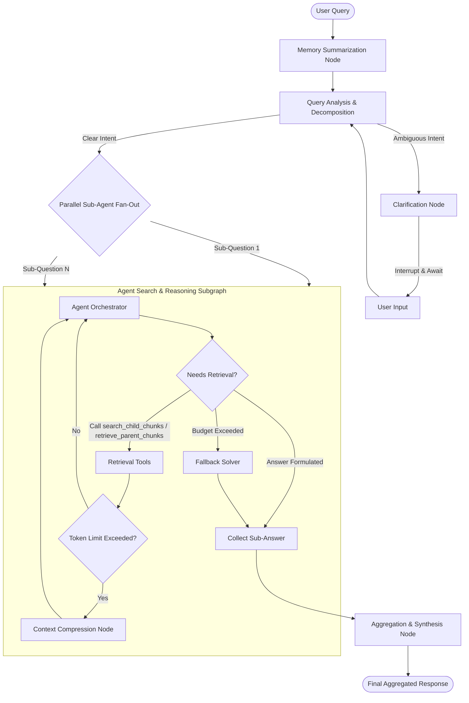

# Orchestra RAG

[](#)
[](#)
[](#)

**Orchestra RAG** is a highly modular, production-ready **Agentic Retrieval-Augmented Generation (RAG)** engine built on **LangGraph**. Designed to handle complex, multi-part, and ambiguous user queries, the system acts as an intelligent state machine that decomposes requests, schedules parallel retrieval sub-agents, manages memory, compresses context, and pauses for human clarification when query intent is unclear.

---

## 🏗️ System Architecture

Unlike standard, linear RAG pipelines that execute simple search-and-synthesize loops, Orchestra RAG orchestrates state transitions dynamically.



---

## 🌟 Key Features

* **Multi-Agent Map-Reduce (Fan-Out/Fan-In)**: Complex, compound queries are decomposed into unique sub-questions, each executed in parallel by dedicated sub-agents to optimize latency and search coverage.
* **Hierarchical Ingestion (Parent-Child Chunking)**: Indexes short child segments for precise vector similarity matches while retrieving larger parent blocks to maintain context for response generation.
* **Human-in-the-Loop (HITL) Clarification**: Ambiguous queries trigger a state graph interrupt, prompting the user for clarification before running search tasks.
* **Rolling Conversation Memory**: Older conversation logs are automatically summarized into a rolling memory state to prevent context window explosion and reduce inference costs.
* **Adaptive Context Compression**: Monitored tokens trigger mid-run context compression, synthesizing raw tool outputs into high-density summaries to prevent token overflow.
* **Hybrid Search Engine**: Merges dense vector embeddings (semantic matching) with sparse vector representations (BM25 keyword matching) using Qdrant.
* **Observability-First Design**: Native hooks for Langfuse tracing to monitor latencies, costs, token usage, and graph step histories.

---

## 📂 Project Organization

```
├── project/
│   ├── app.py                # Gradio UI application entry point
│   ├── config.py             # Centralized settings (chunking, LLM selection, thresholds)
│   ├── utils.py              # PDF parsing and offline token estimation
│   ├── document_chunker.py   # Parent-child chunking & markdown header segmentation
│   ├── core/
│   │   ├── rag_system.py     # RAG graph compilation & wrapper
│   │   ├── document_manager.py# Document pipeline (convert, chunk, index)
│   │   └── chat_interface.py # Session controller and response streaming
│   ├── db/
│   │   ├── vector_db_manager.py # Qdrant dense+sparse client manager
│   │   └── parent_store_manager.py # Local JSON parent store persistence
│   ├── rag_agent/
│   │   ├── graph.py          # StateGraph definitions and route compilation
│   │   ├── graph_state.py    # State declarations for main graph & sub-agents
│   │   ├── nodes.py          # Processing nodes (Orchestrator, rewrite, compress)
│   │   ├── edges.py          # Dynamic routing rules
│   │   └── tools.py          # Retrieval tools (search_child, retrieve_parent)
│   └── ui/
│       ├── css.py            # Gradio custom CSS stylesheets
│       └── gradio_app.py     # Multi-tab layout configuration
├── notebooks/                # Development notebooks
└── requirements.txt          # Python dependency specifications
```

---

## ⚙️ Configuration Guide

All system settings are consolidated in `project/config.py`. Here are the primary settings available to customize your deployment:

| Parameter | Type | Default Value | Description |
| :--- | :---: | :---: | :--- |
| `DENSE_MODEL` | String | `"Qwen/Qwen3-Embedding-0.6B"` | SentenceTransformer embedding model for semantic search. |
| `SPARSE_MODEL` | String | `"Qdrant/bm25"` | Sparse model used for exact keyword search. |
| `LLM_MODEL` | String | `"granite4.1:8b"` | Primary reasoning LLM. (Can be local or cloud provider). |
| `RETRIEVAL_SCORE_THRESHOLD`| Float | `0.4` | Minimum similarity score required for retrieved child chunks. |
| `DEFAULT_RETRIEVAL_K` | Integer| `7` | Number of child chunks to retrieve per search. |
| `MAX_TOOL_CALLS` | Integer| `8` | Research budget cap for agent tool calls. |
| `MAX_ITERATIONS` | Integer| `10` | Reasoning iteration cap for agent search loops. |
| `CHILD_CHUNK_SIZE` | Integer| `500` | Target character size for child chunks. |
| `MAX_PARENT_SIZE` | Integer| `4000` | Maximum character size for parent context chunks. |

---

## 🚀 Getting Started

### Prerequisites
* Python 3.11+
* Local [Ollama](https://ollama.com/) instance (or cloud API keys for OpenAI/Anthropic/Gemini)

### Installation
1. Clone the repository:
   ```bash
   git clone https://github.com/<your-username>/orchestra-rag.git
   cd orchestra-rag
   ```

2. Create and activate a virtual environment:
   ```bash
   python -m venv .venv
   source .venv/bin/activate  # On Windows use: .venv\Scripts\activate
   ```

3. Install required packages:
   ```bash
   pip install -r requirements.txt
   ```

4. *(Optional)* Set up environment variables for observability:
   ```bash
   export LANGFUSE_ENABLED=true
   export LANGFUSE_PUBLIC_KEY="your-public-key"
   export LANGFUSE_SECRET_KEY="your-secret-key"
   export LANGFUSE_BASE_URL="https://cloud.langfuse.com"
   ```

### Running the Application
To launch the interactive Gradio interface locally:
```bash
python project/app.py
```
Open `http://localhost:7860` in your web browser to upload documents and begin testing.

---

## 🔧 Switching LLM Providers

Orchestra RAG is designed to be model-agnostic. To swap your LLM from local Ollama to a cloud provider:

1. Install the provider package:
   ```bash
   pip install langchain-google-genai  # For Gemini
   # or: pip install langchain-openai langchain-anthropic
   ```
2. Configure credentials:
   ```bash
   export GOOGLE_API_KEY="your-api-key"
   ```
3. Update `project/core/rag_system.py` initialization to load the respective wrapper (e.g., `ChatGoogleGenerativeAI`).

---

## 📊 Evaluation & Benchmarking

The `notebooks/evaluation.ipynb` script integrates with **Ragas** to assess your RAG system's outputs. You can measure:
* **Context Recall**: Quality of the retrieval.
* **Faithfulness**: Absence of hallucinations.
* **Answer Relevance**: Usefulness of the final synthesized output.
